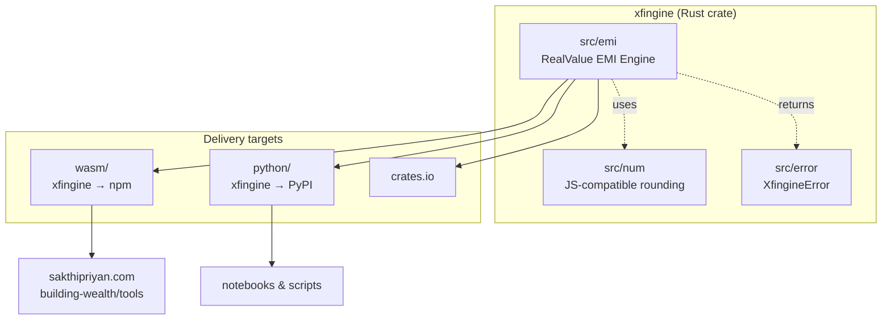

# [Xfingine](https://github.com/xfina-dev/xfingine)

[](https://crates.io/crates/xfingine)
[](https://pypi.org/project/xfingine/)
[](https://www.npmjs.com/package/xfingine)
[](LICENSE)

**Xfingine** is the computation layer behind the personal-finance tools on
[sakthipriyan.com](https://sakthipriyan.com/building-wealth/tools/).

It is a **pure library**. Data in, arithmetic, data out. No UI, no I/O, no
network, no clock — the same input always produces the same output, on every
target.

```
Input data  ──▶  Engine  ──▶  Output data
```

One core written in Rust, shipped three ways:

| Ecosystem | Package | Install |
|---|---|---|
| 🦀 Rust | [`xfingine`](https://crates.io/crates/xfingine) | `cargo add xfingine` |
| 🟨 JavaScript | [`xfingine`](https://www.npmjs.com/package/xfingine) | `npm i xfingine` |
| 🐍 Python | [`xfingine`](https://pypi.org/project/xfingine/) | `pip install xfingine` |

---

## Motivation

The tools on the site started life as standalone JavaScript files — one `.js`
per calculator, each with its own copy of the maths tangled up in its own Vue
components and ECharts wiring. That worked, but it meant the arithmetic could
only ever run in a browser, could not be tested independently of the UI, and
would quietly drift between tools.

Xfingine pulls the arithmetic out into a single Rust core:

1. **Testable.** The maths is separated from rendering, so it can be covered by
   snapshot tests and invariant checks that run in CI.
2. **Portable.** The same engine backs the website (via WASM), notebooks and
   scripts (via Python), and any Rust program — with no risk of three
   implementations disagreeing.
3. **Honest about inflation.** Every engine that projects money into the future
   reports both nominal rupees and rupees discounted to today's value. That is
   the "RealValue" part, and it is the whole point.

---

## Engines

| Engine | Feature | Status | What it does |
|---|---|---|---|
| 📉 RealValue EMI | `emi` | **Production Ready** | Loan amortization schedules in both nominal and inflation-adjusted rupees. Solves for EMI, tenure, or loan amount. |

More engines from the [tools page](https://sakthipriyan.com/building-wealth/tools/)
— RealValue SIP, FX, Portfolio, Family SIP Allocator, IBKR Tax, Emergency Fund —
are intended to follow the same shape.

---

## The RealValue EMI Engine

A standard EMI calculator tells you a ₹50L loan at 9% over 20 years costs
₹1.08 crore. That number is misleading: the payment in year 20 is made with
rupees worth far less than the payment in year 1.

At 6% inflation, that same loan costs **₹63.9L in today's rupees** — the
interest bill shrinks from ₹58L to ₹14L once you stop comparing rupees from
different decades.

The engine solves for whichever variable you don't know:

| `mode` | You supply | You get back |
|---|---|---|
| `emi` | loan amount + tenure | the monthly payment |
| `tenure` | loan amount + payment | how long it takes |
| `loanAmount` | payment + tenure | how much you can borrow |

Alongside the headline figures it returns the full month-by-month schedule and,
if you give it a start month, a per-calendar-year breakdown.

---

## Usage

### Rust

```rust
use xfingine::emi::{compute, EmiRequest, YearMonth};

let request = EmiRequest::emi(5_000_000.0, 240, 9.0)
    .with_inflation(6.0)
    .with_start(YearMonth::new(2026, 1).unwrap());

let result = compute(&request)?;

println!("EMI          ₹{}", result.emi);                    // ₹44986
println!("Nominal cost ₹{}", result.totals.nominal_paid);    // ₹10796818
println!("Real cost    ₹{}", result.totals.real_paid);       // ₹6391327
```

### JavaScript

```js
import init, { compute_emi } from 'xfingine';

await init();

const result = compute_emi({
  mode: 'emi',
  loanAmount: 5_000_000,
  months: 240,
  interestRate: 9,
  inflationRate: 6,
  start: '2026-01',
});

console.log(result.emi);                 // 44986
console.log(result.totals.realPaid);     // 6391327
console.log(result.years[0].nominalTotal);
```

### Python

```python
import xfingine

result = xfingine.compute_emi({
    "mode": "emi",
    "loanAmount": 5_000_000,
    "months": 240,
    "interestRate": 9,
    "inflationRate": 6,
    "start": "2026-01",
})

print(result["emi"])                # 44986
print(result["totals"]["realPaid"]) # 6391327
```

---

## Architecture



Each engine lives behind its own Cargo feature, so a WASM bundle only carries
the maths it actually uses:

```toml
xfingine = { version = "0.0.2", default-features = false, features = ["emi"] }
```

---

## Conventions

These hold across all three ecosystems:

- **Money out is `i64` whole rupees.** Engines compute in `f64` and round at the
  boundary, because that is what a lender actually debits — no fractional paise
  drifting across 360 rows.
- **Rates are percentages,** not fractions. `9.0` means 9%.
- **JSON is `camelCase`** everywhere: Rust, WASM, and Python.
- **No ambient clock.** Dates are opt-in. Omit `start` and the engine is pure
  arithmetic with no calendar; supply it and you get dated rows plus a per-year
  breakdown.

---

## Correctness

The EMI engine was ported from the original `realvalue-emi-engine.js` and is
verified against it, not merely tested in isolation:

- **A differential harness** ran the extracted JavaScript maths and the Rust
  engine over the same inputs and compared every field of every row —
  16 hand-picked scenarios (2,691 rows) plus 600 randomized cases
  (133,686 rows). The output is **bit-identical**, down to the rounding, with a
  single deliberate exception noted in [CHANGELOG.md](CHANGELOG.md).
- **Committed snapshots** in `tests/data/` lock the output in. Unlike
  [Xfina](https://github.com/xfina-dev/xfina), whose fixtures are real
  statements containing PII and therefore live outside the repository, these are
  pure numbers — so they are committed and CI checks them directly.
- **Invariant tests** assert the properties that must hold whatever the numbers
  are: every row's payment splits exactly into principal and interest, the
  balance reaches exactly zero, the per-year breakdown covers every payment
  once, and more inflation always means less real cost.

To re-record snapshots after an intentional change:

```bash
UPDATE_EXPECTED=1 cargo test
```

---

## Development

```bash
cargo test --workspace --all-features   # tests, including doctests and snapshots
cargo fmt --check                       # formatting
cargo clippy --workspace --all-targets --all-features -- -D warnings
```

Building the bindings:

```bash
cd wasm && wasm-pack build --target web     # → wasm/pkg, the npm package
cd python && maturin develop                # → importable xfingine module
```

See [CONTRIBUTING.md](CONTRIBUTING.md) for adding a new engine, and
[AGENTS.md](AGENTS.md) for the project's rules and conventions.

---

## Releasing

Releases are cut with `xtask` and published by GitHub Actions on tag push:

```bash
cargo xtask prepare-release <major|minor|patch>   # bumps version, rolls the changelog, opens a branch
# push the branch, open a PR, merge it
cargo xtask tag-release                          # tags main and pushes
```

The tag triggers `.github/workflows/publish.yml`, which publishes to crates.io,
npm, and PyPI in parallel.

---

## License

Licensed under the [Apache License, Version 2.0](LICENSE).
